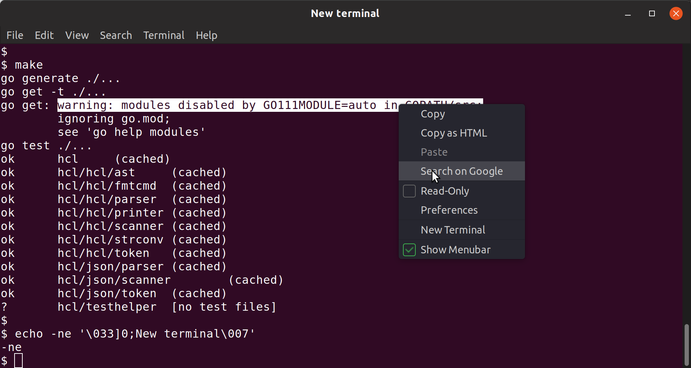

# Custom gnome-terminal

Builds in docker new gnome-terminal binary
which adds "Search on google" to the right click menu.

## Usage

- make build
- make install

## Uninstalling

Uninstall restores original version from APT repositories.

- make uninstall

## DuckDuckGo

Don`t like Google Search? No problem!
You can also build version which goes to DuckDuckGo for a search.

- make build PATCHFILE=search_on_duckduckgo.patch
- make install

## Build locally

If you want to modify patched sources before producing binary, execute `make local`

It will create local src folder in which it will download package and apply specified patch.

## Links

Based on patch from https://askubuntu.com/questions/436318/search-google-from-terminal
